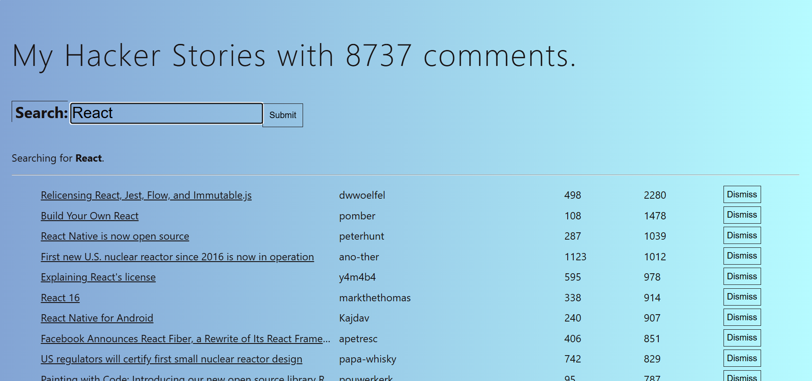

# Hacker Stories — React & TypeScript 学習プロジェクト

[](https://github.com/tomoki-shiozaki/hacker-stories-learning-react/actions/workflows/ci.yml)
[](https://codecov.io/gh/tomoki-shiozaki/hacker-stories-learning-react)
[](LICENSE)

## 概要

Hacker News（技術系ニュース・記事の共有サイト）の API を利用して、ニュース記事を検索・表示・削除できる SPA です。  
React と TypeScript の学習のために作成しました。
教材をベースにしつつ、自分でリファクタリングを行い、学習を深めています。

---

## スクリーンショット



## デプロイ

アプリは以下の URL で公開しています。  
https://hacker-stories-learning-react.onrender.com

## API

- [Hacker News Algolia API](https://hn.algolia.com/api) を利用

## 使用技術

### フロントエンド

- React（Function Components, Hooks）
- TypeScript（型定義、ユニオン型、ジェネリクス）
- Vite（開発環境、ビルドツール）

### スタイリング

- CSS Modules を使用し、各コンポーネントごとにスタイルを分離・管理
- 一部共通スタイル（ボタン）を `common.module.css` に定義し、再利用性を確保

### 状態管理・ロジック

- React Hooks（`useState`, `useReducer`, `useEffect`, `useRef`, `useCallback`, `useMemo`）を活用
- `React.memo` によるコンポーネントのメモ化で、不要な再レンダリングを防止
- `localStorage` を用いた状態の簡易永続化（初回マウントの判定には `useRef` を使用）
- カスタムフック（`useSearch`, `useStories` など）により、ロジックの分離と再利用性・可読性を向上

---

## 工夫したポイント

- 教材をベースにしつつ、責務ごとにファイルを分割・整理（コンポーネント、カスタムフック、ユーティリティなど）して構成を見直した
- ユニットテスト（コンポーネントやカスタムフックなど）や、msw を用いた統合テストを作成
- CRA から Vite へ移行し、ビルド・開発環境を高速化
- GitHub Actions と Codecov を導入し、テスト自動化とカバレッジ測定を行っている

---

## セットアップ方法

```bash
git clone git@github.com:tomoki-shiozaki/hacker-stories-learning-react.git
cd hacker-stories-learning-react
npm install
npm run dev
```

ブラウザで `http://localhost:3000` にアクセスしてアプリを確認してください。

## ライセンス

このプロジェクトは [MIT ライセンス](LICENSE) のもとで公開されています。
